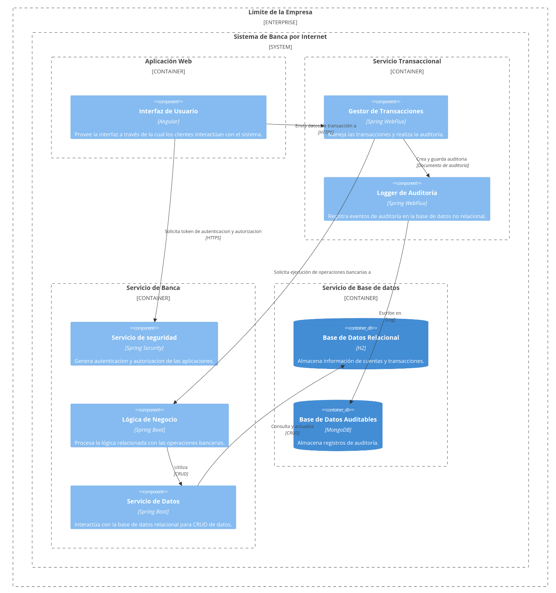

# API Operaciones Bancarias

Este proyecto es una aplicación de operaciones bancarias que permite realizar transacciones como retiros y depósitos en cuentas bancarias. La aplicación está construida utilizando Spring Boot y Reactor para programación reactiva.

## Descripción General

La aplicación proporciona servicios para procesar transacciones bancarias y registrar eventos de auditoría. Para la comunicación asincrónica y el manejo de eventos, se utiliza ActiveMQ como broker de mensajería. Los componentes principales del proyecto incluyen servicios para manejar transacciones, servicios de auditoría, y controladores para gestionar las solicitudes de los clientes.

## Dockerizar la Aplicación desde GHCR

Este documento proporciona los pasos para obtener, ejecutar y administrar un contenedor Docker con una imagen almacenada en GitHub Container Registry (GHCR).

## Prerrequisitos

- Tener instalado [Podman](https://podman.io/)
- Acceso a GitHub Container Registry (GHCR)
- Haber iniciado sesión en GHCR con Docker:

  ```sh
  podman login ghcr.io -u <USERNAME> -p <PASSWORD> ghcr.io 
  ```

## Descargar y ejecutar el proyecto en contenedor

- **Crear network**

    ```sh
    podman network create red-bank
    ```

- **Descargar la imagen desde GHCR**

    ```sh
    podman pull ghcr.io/charlsk8/operaciones_bancarias:v1.0.0 
    ```

- **Correr el contenedor**

    ```sh
    podman run --rm --name reactivo --network=red-bank -p 8093:8093 -d ghcr.io/charlsk8/operaciones_bancarias:v1.0.0 
    ```

- **Probar la Aplicación**

    ```sh
    curl http://localhost:8093/api/v1/auditoria/stream?cuentaId=1198031672
    ```

## Generar imagen local

- **Construir imagen**

    ```sh
    podman build -t operaciones-bancarias -f Containerfile . 
    ```

- **Correr el contenedor**

    ```sh
    podman run --rm --name reactivo --network=red-bank -p 8093:8093 -d operaciones-bancarias
    ```

## Componentes Principales

### 1. TransaccionesServiceImpl

Ubicación: `src/main/java/com/banco/operaciones_bancarias/service/impl/TransaccionesServiceImpl.java`

Este servicio implementa la interfaz `ITransaccionesService` y maneja las operaciones de retiro y depósito en cuentas bancarias. Utiliza `CoreBancarioSofka` para interactuar con el núcleo bancario y `AuditoriaLogger` para registrar eventos de auditoría.

#### Métodos Principales

- `procesarRetiro(RetiroCuentaRequestDTO request, String token)`: Procesa una solicitud de retiro y registra eventos de auditoría.
- `procesarDeposito(DepositoCuentaRequestDTO request, String token)`: Procesa una solicitud de depósito y registra eventos de auditoría.

### 2. Constants

Ubicación: `src/main/java/com/banco/operaciones_bancarias/utils/Constants.java`

Esta clase define constantes utilizadas en toda la aplicación para identificar tipos de transacciones y estados de auditoría.

#### Constantes Principales

- `RETIRO`
- `DEPOSITO`
- `INICIO`
- `EXITO`
- `ERROR`

### 3. IEventoAuditoriaService

Ubicación: `src/main/java/com/banco/operaciones_bancarias/service/IEventoAuditoriaService.java`

Esta interfaz define el contrato para los servicios que manejan eventos de auditoría. Proporciona un método para obtener un flujo de eventos de auditoría basado en el ID de la cuenta.

#### Método Principal

- `Flux<EventoAuditoria> streamEventosAuditoria(int cuentaId)`: Devuelve un flujo de eventos de auditoría para una cuenta específica.

### 4. CuentaAuditoriaServiceImpl

Ubicación: `src/main/java/com/banco/operaciones_bancarias/service/impl/CuentaAuditoriaServiceImpl.java`

Este servicio implementa la interfaz `IEventoAuditoriaService` y proporciona la funcionalidad para obtener eventos de auditoría desde el repositorio `IEventoAuditoriaRepository`.

### 5. TransaccionesControllerTest

Ubicación: `src/test/java/com/banco/operaciones_bancarias/controller/TransaccionesControllerTest.java`

Esta clase contiene pruebas unitarias para el controlador de transacciones. Utiliza Mockito para simular dependencias y StepVerifier para verificar el comportamiento reactivo.

#### Pruebas Principales

- `procesarRetiro_CuandoExitoso_RetornaResponseOk()`: Verifica que una solicitud de retiro exitosa retorne una respuesta correcta.
- `procesarDeposito_CuandoExitoso_RetornaResponseOk()`: Verifica que una solicitud de depósito exitosa retorne una respuesta correcta.

### Tecnologías Utilizadas

Este proyecto utiliza una variedad de tecnologías y bibliotecas para proporcionar una funcionalidad completa y robusta. A continuación se enumeran las principales tecnologías utilizadas:

- **Java 17**: Lenguaje de programación principal utilizado para desarrollar la aplicación.
- **Spring Boot**: Framework utilizado para crear aplicaciones basadas en Spring de manera rápida y sencilla.
- **WebFlux**: Framework para aplicaciones basadas en Spring de manera reactiva.
- **Lombok**: Herramienta que reduce el código boilerplate mediante anotaciones.
- **Mockito**: Framework de pruebas utilizado para crear mocks y realizar pruebas unitarias.
- **JUnit 5**: Framework de pruebas utilizado para escribir y ejecutar pruebas unitarias.
- **ReactiveMongoDB**: Base de datos NoSQL utilizada para almacenar eventos de auditoría de manera reactiva.
- **Swagger**: Herramienta utilizada para documentar y probar APIs RESTful.
- **Git**: Sistema de control de versiones utilizado para el control de versiones del código fuente.
- **Gradle**: Herramienta de construcción utilizada para compilar y ejecutar la aplicación.

### URL para Transacciones en Tiempo Real

La siguiente URL permite acceder a un flujo de eventos de auditoría en tiempo real para una cuenta específica. Al proporcionar el `cuentaId` como parámetro, se pueden observar las transacciones y eventos de auditoría a medida que ocurren.

`http://localhost:8093/api/v1/auditoria/stream?cuentaId=1234`

### Documentación de Swagger

Swagger es una herramienta poderosa para documentar y probar APIs RESTful. En este proyecto, se ha utilizado Swagger para generar automáticamente la documentación de la API, lo que facilita a los desarrolladores y a otros interesados comprender y probar los endpoints disponibles.

#### Acceso a la Documentación de Swagger

La documentación de Swagger para esta aplicación está disponible en la siguiente URL:

`http://localhost:8093/webjars/swagger-ui/index.html`

Al acceder a esta URL, se puede visualizar una interfaz gráfica que muestra todos los endpoints disponibles, junto con sus métodos HTTP, parámetros requeridos, y posibles respuestas. Además, Swagger permite probar directamente los endpoints desde la interfaz, lo que facilita la verificación y el debugging de la API.

## Diagrama de Componentes



## Test assessment
